# TỔNG HỢP MÃ NGUỒN PLANTUML CHO BÁO CÁO (ĐÃ TỐI ƯU ĐƯỜNG THẲNG & CHỐNG CẮT KHUNG)

Tài liệu này đã được tinh chỉnh toàn bộ cấu hình đồ họa PlantUML để khắc phục triệt để lỗi vẽ đường cong vòng vèo và lỗi đường kẻ cắt ngang qua các khối (box):
1. **Ép kiểu đường thẳng vuông góc / gấp khúc thẳng**: Sử dụng `skinparam linetype ortho` (đường thẳng vuông góc 90° chuẩn học thuật) và `skinparam linetype polyline` (đường thẳng trực tiếp cho sơ đồ Use Case), loại bỏ hoàn toàn đường cong spline mặc định.
2. **Sắp xếp bố cục theo cột và tầng cố định (`nodesep`, `ranksep`, hướng mũi tên `-down->`, `-right->` và liên kết ẩn `-[hidden]->`)**: Giúp các khối nằm đúng hàng/cột, đường nối đi thẳng ngắn nhất từ khối A sang khối B mà **không bao giờ đâm xuyên qua khối khác**.
3. **Chuẩn hóa quan hệ Use Case**: Loại bỏ các mũi tên trùng lặp xuyên tầng (ví dụ: ở Hình 2.3, gom toàn bộ Use Case vào 1 cột dọc ở giữa, Tác nhân bên trái nối thẳng vào bên trái Use Case, Tác nhân Server bên phải nối thẳng vào bên phải Use Case).

---

## 📋 Danh mục Hình ảnh Đề xuất Cập nhật cho Báo cáo

| Số hiệu | Tên hình trong báo cáo (Đã chuẩn hóa) | Kiểu đường kẻ áp dụng |
| :--- | :--- | :--- |
| **Hình 2.1** | Sơ đồ Use Case tổng quát | Đường thẳng trực tiếp (`polyline`) - Bố cục 3 cột không cắt nhau |
| **Hình 2.2** | Sơ đồ Use Case theo vai trò quản trị | Đường thẳng trực tiếp (`polyline`) - Phân tách 2 cụm chức năng |
| **Hình 2.3** | Sơ đồ Use Case của Agent và Tác nhân hệ thống | Đường thẳng trực tiếp (`polyline`) - 1 cột Use Case ở giữa, không vòng dây |
| **Hình 2.4** | Sơ đồ kiến trúc tổng thể hệ thống | Đường thẳng vuông góc (`ortho`) - 3 tầng thẳng hàng dọc |
| **Hình 2.5** | Sơ đồ kiến trúc hệ thống (tầng Server) | Đường thẳng vuông góc (`ortho`) - 4 lớp phân tầng từ trên xuống |
| **Hình 2.6** | Sơ đồ kiến trúc hệ thống (tầng Client) | Đường thẳng vuông góc (`ortho`) - 2 nhánh song song Web & Android |
| **Hình 2.7** | Sơ đồ kiến trúc hệ thống (tầng Data) | Đường thẳng vuông góc (`ortho`) - Sắp xếp theo lưới 2 tầng |
| **Hình 2.8** | Class Diagram nhóm Tổ chức và Thiết bị (1) | Đường thẳng vuông góc (`ortho`) - Lưới 3 hàng không cắt chéo |
| **Hình 2.9** | Class Diagram nhóm Lệnh, Cảnh báo và Sự kiện (2) | Đường thẳng vuông góc (`ortho`) - Bố cục đối xứng trái/phải |
| **Hình 2.10** | Class Diagram nhóm Người dùng và Nhật ký hệ thống (3) | Đường thẳng vuông góc (`ortho`) - Bố cục hình cây từ trên xuống |
| **Hình 2.11** | Sơ đồ hoạt động luồng ghi danh thiết bị | Đường thẳng vuông góc (`ortho`) - Swimlane chuẩn |
| **Hình 2.12** | Sơ đồ hoạt động phát hiện ứng dụng cấm và khóa màn hình tự động | Đường thẳng vuông góc (`ortho`) - Swimlane chuẩn |
| **Hình 2.13** | Sơ đồ hoạt động điều khiển thiết bị từ xa và xử lý cảnh báo | Đường thẳng vuông góc (`ortho`) - Swimlane chuẩn |
| **Hình 2.14** | Sơ đồ hoạt động quản lý và giám sát lớp học 3D | Đường thẳng vuông góc (`ortho`) - Swimlane chuẩn |
| **Hình 2.15** | Sơ đồ tuần tự cập nhật ứng dụng ngầm | Đường thẳng ngang chuẩn Sequence Diagram |
| **Hình 2.16** | Sơ đồ tuần tự truyền phát màn hình | Đường thẳng ngang chuẩn Sequence Diagram |
| **Hình 2.17** | Sơ đồ tuần tự đồng bộ thông số thời gian thực | Đường thẳng ngang chuẩn Sequence Diagram |
| **Hình 2.18** | Sơ đồ lớp kiến trúc mã nguồn Backend (`mdm-server`) | Đường thẳng vuông góc (`ortho`) - Căn thẳng cột theo từng Module |
| **Hình 2.19** | Sơ đồ lớp kiến trúc mã nguồn Android Agent (`android-agent`) | Đường thẳng vuông góc (`ortho`) - Phân tầng Clean Architecture |
| **Hình 2.20** | *(Tùy chọn)* Sơ đồ hoạt động kiểm soát truy cập theo Khu vực | Đường thẳng vuông góc (`ortho`) - Swimlane chuẩn |

---

## Hình 2.1. Sơ đồ Use Case tổng quát

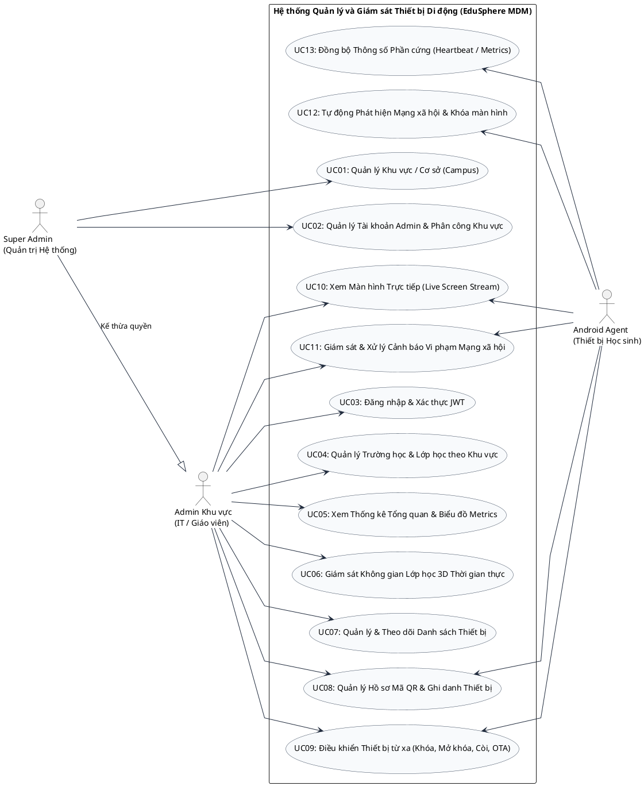
```plantuml
@startuml Hinh_2_1_UseCase_TongQuat
left to right direction
skinparam linetype polyline
skinparam nodesep 25
skinparam ranksep 80
skinparam packageStyle rectangle
skinparam shadowing false
skinparam usecase {
    BackgroundColor #F8FAFC
    BorderColor #334155
    ArrowColor #1E293B
}

actor "Super Admin\n(Quản trị Hệ thống)" as SA
actor "Admin Khu vực\n(IT / Giáo viên)" as Admin
actor "Android Agent\n(Thiết bị Học sinh)" as Agent

SA -down-|> Admin : Kế thừa quyền

rectangle "Hệ thống Quản lý và Giám sát Thiết bị Di động (EduSphere MDM)" {
    usecase "UC01: Quản lý Khu vực / Cơ sở (Campus)" as UC01
    usecase "UC02: Quản lý Tài khoản Admin & Phân công Khu vực" as UC02
    usecase "UC03: Đăng nhập & Xác thực JWT" as UC03
    usecase "UC04: Quản lý Trường học & Lớp học theo Khu vực" as UC04
    usecase "UC05: Xem Thống kê Tổng quan & Biểu đồ Metrics" as UC05
    usecase "UC06: Giám sát Không gian Lớp học 3D Thời gian thực" as UC06
    usecase "UC07: Quản lý & Theo dõi Danh sách Thiết bị" as UC07
    usecase "UC08: Quản lý Hồ sơ Mã QR & Ghi danh Thiết bị" as UC08
    usecase "UC09: Điều khiển Thiết bị từ xa (Khóa, Mở khóa, Còi, OTA)" as UC09
    usecase "UC10: Xem Màn hình Trực tiếp (Live Screen Stream)" as UC10
    usecase "UC11: Giám sát & Xử lý Cảnh báo Vi phạm Mạng xã hội" as UC11
    usecase "UC12: Tự động Phát hiện Mạng xã hội & Khóa màn hình" as UC12
    usecase "UC13: Đồng bộ Thông số Phần cứng (Heartbeat / Metrics)" as UC13

    UC01 -[hidden]right- UC02
    UC02 -[hidden]right- UC03
    UC03 -[hidden]right- UC04
    UC04 -[hidden]right- UC05
    UC05 -[hidden]right- UC06
    UC06 -[hidden]right- UC07
    UC07 -[hidden]right- UC08
    UC08 -[hidden]right- UC09
    UC09 -[hidden]right- UC10
    UC10 -[hidden]right- UC11
    UC11 -[hidden]right- UC12
    UC12 -[hidden]right- UC13
}

SA --> UC01
SA --> UC02

Admin --> UC03
Admin --> UC04
Admin --> UC05
Admin --> UC06
Admin --> UC07
Admin --> UC08
Admin --> UC09
Admin --> UC10
Admin --> UC11

UC08 <-- Agent
UC09 <-- Agent
UC10 <-- Agent
UC11 <-- Agent
UC12 <-- Agent
UC13 <-- Agent
@enduml
```

---

## Hình 2.2. Sơ đồ Use Case theo vai trò quản trị

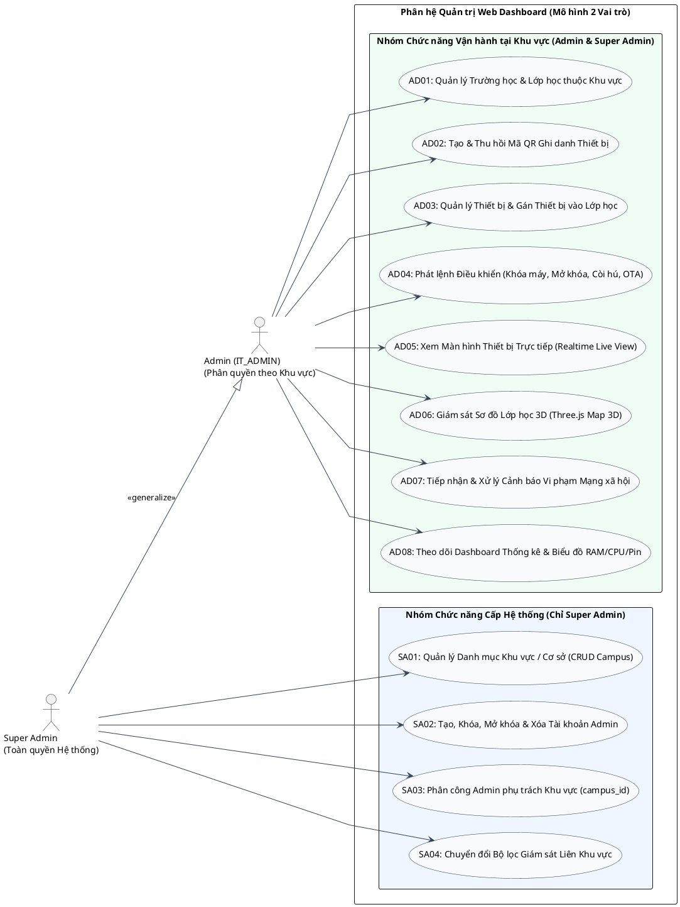
```plantuml
@startuml Hinh_2_2_UseCase_TheoVaiTro
left to right direction
skinparam linetype polyline
skinparam nodesep 25
skinparam ranksep 90
skinparam packageStyle rectangle
skinparam shadowing false
skinparam usecase {
    BackgroundColor #F8FAFC
    BorderColor #1E293B
    ArrowColor #334155
}

actor "Super Admin\n(Toàn quyền Hệ thống)" as SA
actor "Admin (IT_ADMIN)\n(Phân quyền theo Khu vực)" as Admin

SA -down-|> Admin : <<generalize>>

rectangle "Phân hệ Quản trị Web Dashboard (Mô hình 2 Vai trò)" {

    package "Nhóm Chức năng Cấp Hệ thống (Chỉ Super Admin)" #EFF6FF {
        usecase "SA01: Quản lý Danh mục Khu vực / Cơ sở (CRUD Campus)" as SA1
        usecase "SA02: Tạo, Khóa, Mở khóa & Xóa Tài khoản Admin" as SA2
        usecase "SA03: Phân công Admin phụ trách Khu vực (campus_id)" as SA3
        usecase "SA04: Chuyển đổi Bộ lọc Giám sát Liên Khu vực" as SA4
    }

    package "Nhóm Chức năng Vận hành tại Khu vực (Admin & Super Admin)" #F0FDF4 {
        usecase "AD01: Quản lý Trường học & Lớp học thuộc Khu vực" as AD1
        usecase "AD02: Tạo & Thu hồi Mã QR Ghi danh Thiết bị" as AD2
        usecase "AD03: Quản lý Thiết bị & Gán Thiết bị vào Lớp học" as AD3
        usecase "AD04: Phát lệnh Điều khiển (Khóa máy, Mở khóa, Còi hú, OTA)" as AD4
        usecase "AD05: Xem Màn hình Thiết bị Trực tiếp (Realtime Live View)" as AD5
        usecase "AD06: Giám sát Sơ đồ Lớp học 3D (Three.js Map 3D)" as AD6
        usecase "AD07: Tiếp nhận & Xử lý Cảnh báo Vi phạm Mạng xã hội" as AD7
        usecase "AD08: Theo dõi Dashboard Thống kê & Biểu đồ RAM/CPU/Pin" as AD8
    }
}

SA --> SA1
SA --> SA2
SA --> SA3
SA --> SA4

Admin --> AD1
Admin --> AD2
Admin --> AD3
Admin --> AD4
Admin --> AD5
Admin --> AD6
Admin --> AD7
Admin --> AD8
@enduml
```

---

## Hình 2.3. Sơ đồ Use Case của Agent và Tác nhân hệ thống

*(Đã xếp toàn bộ Use Case thành 1 cột dọc duy nhất ở giữa, dùng liên kết `.>` cùng cột cho `<<include>>` để các đường nối từ Trái sang Phải hoàn toàn thẳng tắp, không còn đường vòng hay cắt ngang qua các hình elip như ảnh cũ).*

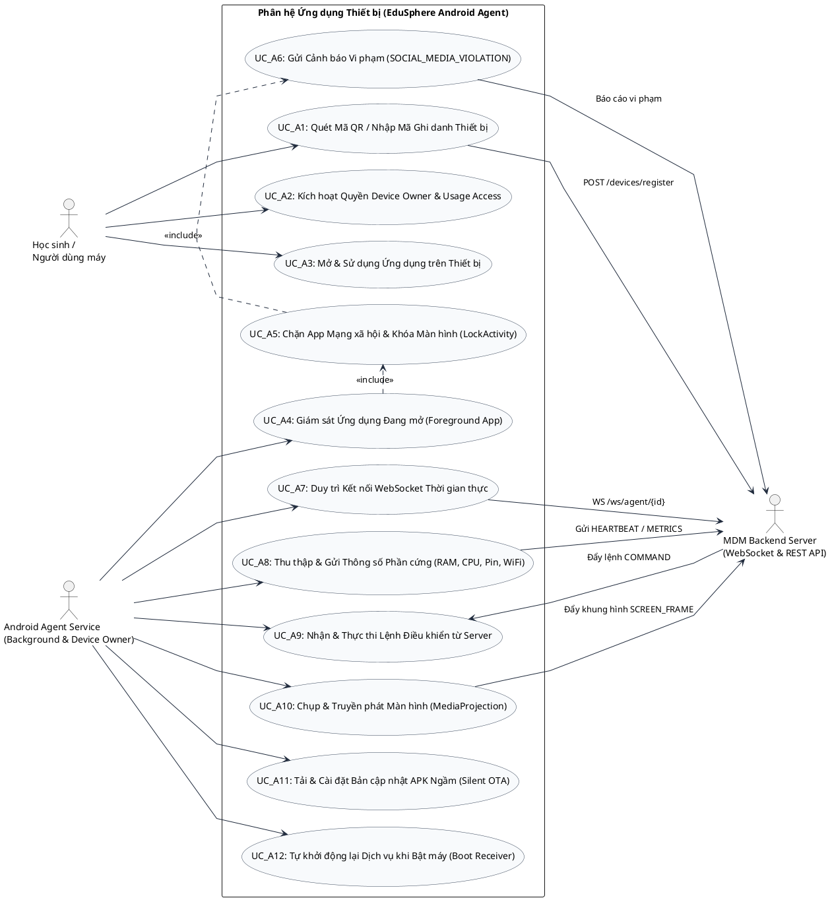
```plantuml
@startuml Hinh_2_3_UseCase_Agent
left to right direction
skinparam linetype polyline
skinparam nodesep 25
skinparam ranksep 90
skinparam packageStyle rectangle
skinparam shadowing false
skinparam usecase {
    BackgroundColor #F8FAFC
    BorderColor #334155
    ArrowColor #1E293B
}

actor "Học sinh /\nNgười dùng máy" as Student
actor "Android Agent Service\n(Background & Device Owner)" as AgentSystem
actor "MDM Backend Server\n(WebSocket & REST API)" as Server

Student -[hidden]right- AgentSystem

rectangle "Phân hệ Ứng dụng Thiết bị (EduSphere Android Agent)" {
    usecase "UC_A1: Quét Mã QR / Nhập Mã Ghi danh Thiết bị" as UCA1
    usecase "UC_A2: Kích hoạt Quyền Device Owner & Usage Access" as UCA2
    usecase "UC_A3: Mở & Sử dụng Ứng dụng trên Thiết bị" as UCA3
    usecase "UC_A4: Giám sát Ứng dụng Đang mở (Foreground App)" as UCA4
    usecase "UC_A5: Chặn App Mạng xã hội & Khóa Màn hình (LockActivity)" as UCA5
    usecase "UC_A6: Gửi Cảnh báo Vi phạm (SOCIAL_MEDIA_VIOLATION)" as UCA6
    usecase "UC_A7: Duy trì Kết nối WebSocket Thời gian thực" as UCA7
    usecase "UC_A8: Thu thập & Gửi Thông số Phần cứng (RAM, CPU, Pin, WiFi)" as UCA8
    usecase "UC_A9: Nhận & Thực thi Lệnh Điều khiển từ Server" as UCA9
    usecase "UC_A10: Chụp & Truyền phát Màn hình (MediaProjection)" as UCA10
    usecase "UC_A11: Tải & Cài đặt Bản cập nhật APK Ngầm (Silent OTA)" as UCA11
    usecase "UC_A12: Tự khởi động lại Dịch vụ khi Bật máy (Boot Receiver)" as UCA12

    UCA4 .> UCA5 : <<include>>
    UCA5 .> UCA6 : <<include>>
}

Student --> UCA1
Student --> UCA2
Student --> UCA3

AgentSystem --> UCA4
AgentSystem --> UCA7
AgentSystem --> UCA8
AgentSystem --> UCA9
AgentSystem --> UCA10
AgentSystem --> UCA11
AgentSystem --> UCA12

UCA1 --> Server : POST /devices/register
UCA6 --> Server : Báo cáo vi phạm
UCA7 --> Server : WS /ws/agent/{id}
UCA8 --> Server : Gửi HEARTBEAT / METRICS
UCA9 <-- Server : Đẩy lệnh COMMAND
UCA10 --> Server : Đẩy khung hình SCREEN_FRAME
@enduml
```

---

## Hình 2.4. Sơ đồ kiến trúc hệ thống

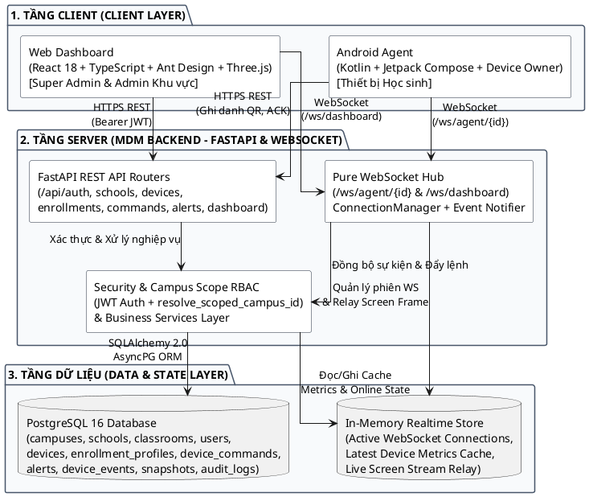
```plantuml
@startuml Hinh_2_4_KienTruc_TongThe
top to bottom direction
skinparam linetype ortho
skinparam nodesep 60
skinparam ranksep 60
skinparam componentStyle rectangle
skinparam shadowing false
skinparam package {
    BackgroundColor #F8FAFC
    BorderColor #475569
}
skinparam component {
    BackgroundColor #FFFFFF
    BorderColor #1E293B
}

package "1. TẦNG CLIENT (CLIENT LAYER)" {
    component "Web Dashboard\n(React 18 + TypeScript + Ant Design + Three.js)\n[Super Admin & Admin Khu vực]" as WebClient
    component "Android Agent\n(Kotlin + Jetpack Compose + Device Owner)\n[Thiết bị Học sinh]" as AndroidClient
    WebClient -[hidden]right- AndroidClient
}

package "2. TẦNG SERVER (MDM BACKEND - FASTAPI & WEBSOCKET)" {
    component "FastAPI REST API Routers\n(/api/auth, schools, devices,\nenrollments, commands, alerts, dashboard)" as RestAPI
    component "Pure WebSocket Hub\n(/ws/agent/{id} & /ws/dashboard)\nConnectionManager + Event Notifier" as WSHub
    component "Security & Campus Scope RBAC\n(JWT Auth + resolve_scoped_campus_id)\n& Business Services Layer" as Services

    RestAPI -[hidden]right- WSHub
    RestAPI -down-> Services : Xác thực & Xử lý nghiệp vụ
    WSHub -down-> Services : Đồng bộ sự kiện & Đẩy lệnh
}

package "3. TẦNG DỮ LIỆU (DATA & STATE LAYER)" {
    database "PostgreSQL 16 Database\n(campuses, schools, classrooms, users,\ndevices, enrollment_profiles, device_commands,\nalerts, device_events, snapshots, audit_logs)" as PostgresDB
    database "In-Memory Realtime Store\n(Active WebSocket Connections,\nLatest Device Metrics Cache,\nLive Screen Stream Relay)" as MemoryStore
    PostgresDB -[hidden]right- MemoryStore
}

WebClient -down-> RestAPI : HTTPS REST\n(Bearer JWT)
WebClient -down-> WSHub : WebSocket\n(/ws/dashboard)

AndroidClient -down-> RestAPI : HTTPS REST\n(Ghi danh QR, ACK)
AndroidClient -down-> WSHub : WebSocket\n(/ws/agent/{id})

Services -down-> PostgresDB : SQLAlchemy 2.0\nAsyncPG ORM
Services -down-> MemoryStore : Đọc/Ghi Cache\nMetrics & Online State
WSHub -down-> MemoryStore : Quản lý phiên WS\n& Relay Screen Frame
@enduml
```

---

## Hình 2.5. Sơ đồ kiến trúc hệ thống (tầng Server)

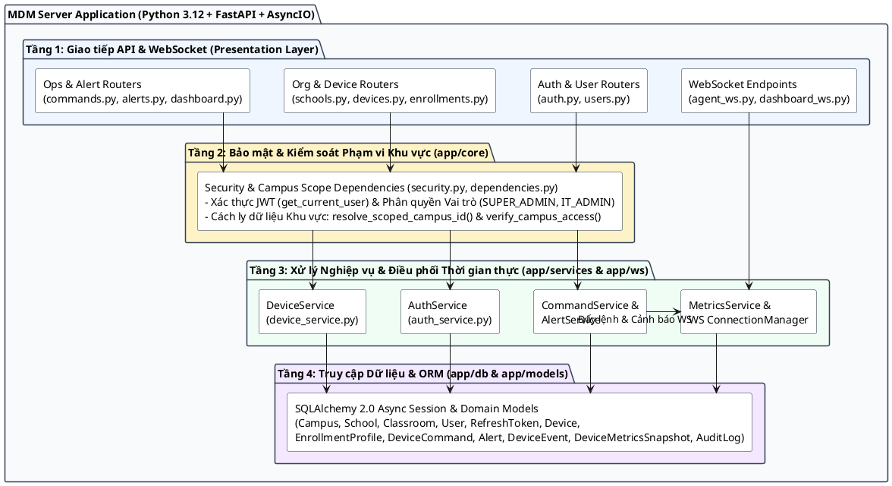
```plantuml
@startuml Hinh_2_5_KienTruc_TangServer
top to bottom direction
skinparam linetype ortho
skinparam nodesep 45
skinparam ranksep 55
skinparam componentStyle rectangle
skinparam shadowing false
skinparam package {
    BackgroundColor #F8FAFC
    BorderColor #334155
}
skinparam component {
    BackgroundColor #FFFFFF
    BorderColor #1E293B
}

package "MDM Server Application (Python 3.12 + FastAPI + AsyncIO)" {

    package "Tầng 1: Giao tiếp API & WebSocket (Presentation Layer)" #EFF6FF {
        component "Auth & User Routers\n(auth.py, users.py)" as R_Auth
        component "Org & Device Routers\n(schools.py, devices.py, enrollments.py)" as R_Dev
        component "Ops & Alert Routers\n(commands.py, alerts.py, dashboard.py)" as R_Ops
        component "WebSocket Endpoints\n(agent_ws.py, dashboard_ws.py)" as WS_End
    }

    package "Tầng 2: Bảo mật & Kiểm soát Phạm vi Khu vực (app/core)" #FEF3C7 {
        component "Security & Campus Scope Dependencies (security.py, dependencies.py)\n- Xác thực JWT (get_current_user) & Phân quyền Vai trò (SUPER_ADMIN, IT_ADMIN)\n- Cách ly dữ liệu Khu vực: resolve_scoped_campus_id() & verify_campus_access()" as CoreSec
    }

    package "Tầng 3: Xử lý Nghiệp vụ & Điều phối Thời gian thực (app/services & app/ws)" #F0FDF4 {
        component "AuthService\n(auth_service.py)" as S_Auth
        component "DeviceService\n(device_service.py)" as S_Dev
        component "CommandService &\nAlertService" as S_Ops
        component "MetricsService &\nWS ConnectionManager" as S_WS
    }

    package "Tầng 4: Truy cập Dữ liệu & ORM (app/db & app/models)" #F3E8FF {
        component "SQLAlchemy 2.0 Async Session & Domain Models\n(Campus, School, Classroom, User, RefreshToken, Device,\nEnrollmentProfile, DeviceCommand, Alert, DeviceEvent, DeviceMetricsSnapshot, AuditLog)" as ORM
    }
}

R_Auth -down-> CoreSec
R_Dev -down-> CoreSec
R_Ops -down-> CoreSec

CoreSec -down-> S_Auth
CoreSec -down-> S_Dev
CoreSec -down-> S_Ops
WS_End -down-> S_WS

S_Ops -right-> S_WS : Đẩy lệnh & Cảnh báo WS

S_Auth -down-> ORM
S_Dev -down-> ORM
S_Ops -down-> ORM
S_WS -down-> ORM
@enduml
```

---

## Hình 2.6. Sơ đồ kiến trúc hệ thống (tầng Client)

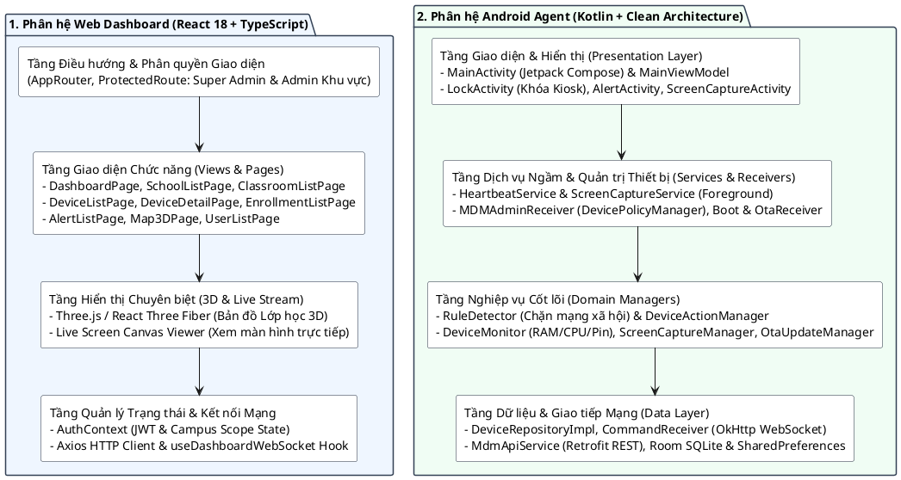
```plantuml
@startuml Hinh_2_6_KienTruc_TangClient
top to bottom direction
skinparam linetype ortho
skinparam nodesep 50
skinparam ranksep 55
skinparam componentStyle rectangle
skinparam shadowing false
skinparam package {
    BackgroundColor #F8FAFC
    BorderColor #334155
}
skinparam component {
    BackgroundColor #FFFFFF
    BorderColor #1E293B
}

package "1. Phân hệ Web Dashboard (React 18 + TypeScript)" #EFF6FF {
    component "Tầng Điều hướng & Phân quyền Giao diện\n(AppRouter, ProtectedRoute: Super Admin & Admin Khu vực)" as W1
    component "Tầng Giao diện Chức năng (Views & Pages)\n- DashboardPage, SchoolListPage, ClassroomListPage\n- DeviceListPage, DeviceDetailPage, EnrollmentListPage\n- AlertListPage, Map3DPage, UserListPage" as W2
    component "Tầng Hiển thị Chuyên biệt (3D & Live Stream)\n- Three.js / React Three Fiber (Bản đồ Lớp học 3D)\n- Live Screen Canvas Viewer (Xem màn hình trực tiếp)" as W3
    component "Tầng Quản lý Trạng thái & Kết nối Mạng\n- AuthContext (JWT & Campus Scope State)\n- Axios HTTP Client & useDashboardWebSocket Hook" as W4

    W1 -down-> W2
    W2 -down-> W3
    W3 -down-> W4
}

package "2. Phân hệ Android Agent (Kotlin + Clean Architecture)" #F0FDF4 {
    component "Tầng Giao diện & Hiển thị (Presentation Layer)\n- MainActivity (Jetpack Compose) & MainViewModel\n- LockActivity (Khóa Kiosk), AlertActivity, ScreenCaptureActivity" as A1
    component "Tầng Dịch vụ Ngầm & Quản trị Thiết bị (Services & Receivers)\n- HeartbeatService & ScreenCaptureService (Foreground)\n- MDMAdminReceiver (DevicePolicyManager), Boot & OtaReceiver" as A2
    component "Tầng Nghiệp vụ Cốt lõi (Domain Managers)\n- RuleDetector (Chặn mạng xã hội) & DeviceActionManager\n- DeviceMonitor (RAM/CPU/Pin), ScreenCaptureManager, OtaUpdateManager" as A3
    component "Tầng Dữ liệu & Giao tiếp Mạng (Data Layer)\n- DeviceRepositoryImpl, CommandReceiver (OkHttp WebSocket)\n- MdmApiService (Retrofit REST), Room SQLite & SharedPreferences" as A4

    A1 -down-> A2
    A2 -down-> A3
    A3 -down-> A4
}

W1 -[hidden]right- A1
@enduml
```

---

## Hình 2.7. Sơ đồ kiến trúc hệ thống (tầng Data)

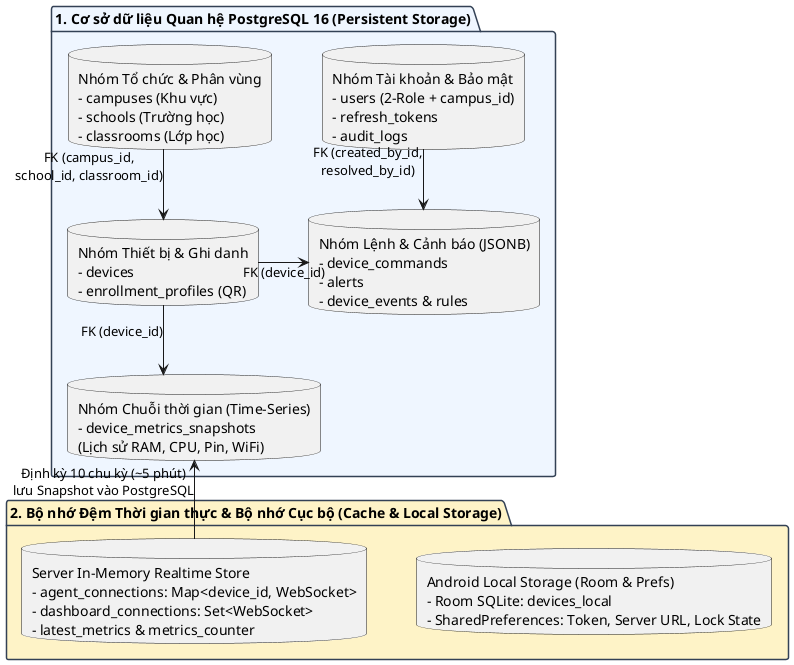
```plantuml
@startuml Hinh_2_7_KienTruc_TangData
top to bottom direction
skinparam linetype ortho
skinparam nodesep 50
skinparam ranksep 60
skinparam componentStyle rectangle
skinparam shadowing false
skinparam package {
    BackgroundColor #F8FAFC
    BorderColor #334155
}

package "1. Cơ sở dữ liệu Quan hệ PostgreSQL 16 (Persistent Storage)" #EFF6FF {
    database "Nhóm Tổ chức & Phân vùng\n- campuses (Khu vực)\n- schools (Trường học)\n- classrooms (Lớp học)" as DB_Org
    database "Nhóm Tài khoản & Bảo mật\n- users (2-Role + campus_id)\n- refresh_tokens\n- audit_logs" as DB_User
    database "Nhóm Thiết bị & Ghi danh\n- devices\n- enrollment_profiles (QR)" as DB_Device
    database "Nhóm Lệnh & Cảnh báo (JSONB)\n- device_commands\n- alerts\n- device_events & rules" as DB_Ops
    database "Nhóm Chuỗi thời gian (Time-Series)\n- device_metrics_snapshots\n(Lịch sử RAM, CPU, Pin, WiFi)" as DB_Metrics

    DB_Org -[hidden]right- DB_User
    DB_Org -down-> DB_Device : FK (campus_id,\nschool_id, classroom_id)
    DB_User -down-> DB_Ops : FK (created_by_id,\nresolved_by_id)
    DB_Device -right-> DB_Ops : FK (device_id)
    DB_Device -down-> DB_Metrics : FK (device_id)
}

package "2. Bộ nhớ Đệm Thời gian thực & Bộ nhớ Cục bộ (Cache & Local Storage)" #FEF3C7 {
    database "Server In-Memory Realtime Store\n- agent_connections: Map<device_id, WebSocket>\n- dashboard_connections: Set<WebSocket>\n- latest_metrics & metrics_counter" as Mem_Cache
    database "Android Local Storage (Room & Prefs)\n- Room SQLite: devices_local\n- SharedPreferences: Token, Server URL, Lock State" as Local_Store

    Mem_Cache -[hidden]right- Local_Store
}

Mem_Cache -up-> DB_Metrics : Định kỳ 10 chu kỳ (~5 phút)\nlưu Snapshot vào PostgreSQL
@enduml
```

---

## Hình 2.8. Class Diagram Tổ chức và Thiết bị (1)

*(Đã thiết kế theo lưới 3 hàng thẳng cột và tích hợp thuộc tính kế thừa từ `BaseModelMixin` bằng stereotype `<<BaseModelMixin>>` để loại bỏ hoàn toàn 5 đường kế thừa cắt chéo qua các đường liên kết khóa ngoại).*

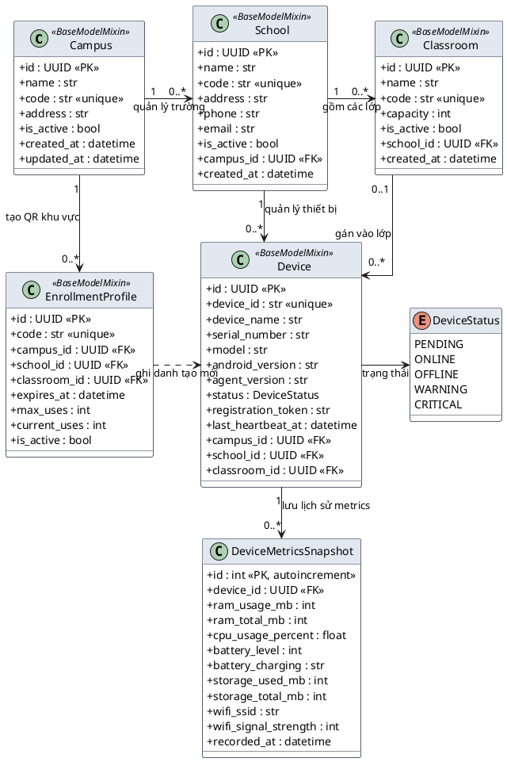
```plantuml
@startuml Hinh_2_8_ClassDiagram_ToChuc_ThietBi
top to bottom direction
skinparam linetype ortho
skinparam nodesep 60
skinparam ranksep 65
skinparam classAttributeIconSize 0
skinparam shadowing false
skinparam class {
    BackgroundColor #FFFFFF
    BorderColor #1E293B
    HeaderBackgroundColor #E2E8F0
}

class Campus <<BaseModelMixin>> {
    + id : UUID <<PK>>
    + name : str
    + code : str <<unique>>
    + address : str
    + is_active : bool
    + created_at : datetime
    + updated_at : datetime
}

class School <<BaseModelMixin>> {
    + id : UUID <<PK>>
    + name : str
    + code : str <<unique>>
    + address : str
    + phone : str
    + email : str
    + is_active : bool
    + campus_id : UUID <<FK>>
    + created_at : datetime
}

class Classroom <<BaseModelMixin>> {
    + id : UUID <<PK>>
    + name : str
    + code : str <<unique>>
    + capacity : int
    + is_active : bool
    + school_id : UUID <<FK>>
    + created_at : datetime
}

class EnrollmentProfile <<BaseModelMixin>> {
    + id : UUID <<PK>>
    + code : str <<unique>>
    + campus_id : UUID <<FK>>
    + school_id : UUID <<FK>>
    + classroom_id : UUID <<FK>>
    + expires_at : datetime
    + max_uses : int
    + current_uses : int
    + is_active : bool
}

class Device <<BaseModelMixin>> {
    + id : UUID <<PK>>
    + device_id : str <<unique>>
    + device_name : str
    + serial_number : str
    + model : str
    + android_version : str
    + agent_version : str
    + status : DeviceStatus
    + registration_token : str
    + last_heartbeat_at : datetime
    + campus_id : UUID <<FK>>
    + school_id : UUID <<FK>>
    + classroom_id : UUID <<FK>>
}

enum DeviceStatus {
    PENDING
    ONLINE
    OFFLINE
    WARNING
    CRITICAL
}

class DeviceMetricsSnapshot {
    + id : int <<PK, autoincrement>>
    + device_id : UUID <<FK>>
    + ram_usage_mb : int
    + ram_total_mb : int
    + cpu_usage_percent : float
    + battery_level : int
    + battery_charging : str
    + storage_used_mb : int
    + storage_total_mb : int
    + wifi_ssid : str
    + wifi_signal_strength : int
    + recorded_at : datetime
}

Campus "1" -right-> "0..*" School : quản lý trường
School "1" -right-> "0..*" Classroom : gồm các lớp

Campus "1" -down-> "0..*" EnrollmentProfile : tạo QR khu vực
School "1" -down-> "0..*" Device : quản lý thiết bị
Classroom "0..1" -down-> "0..*" Device : gán vào lớp

EnrollmentProfile .right.> Device : ghi danh tạo mới
Device -right-> DeviceStatus : trạng thái
Device "1" -down-> "0..*" DeviceMetricsSnapshot : lưu lịch sử metrics
@enduml
```

---

## Hình 2.9. Class Diagram nhóm lệnh, cảnh báo và sự kiện (2)

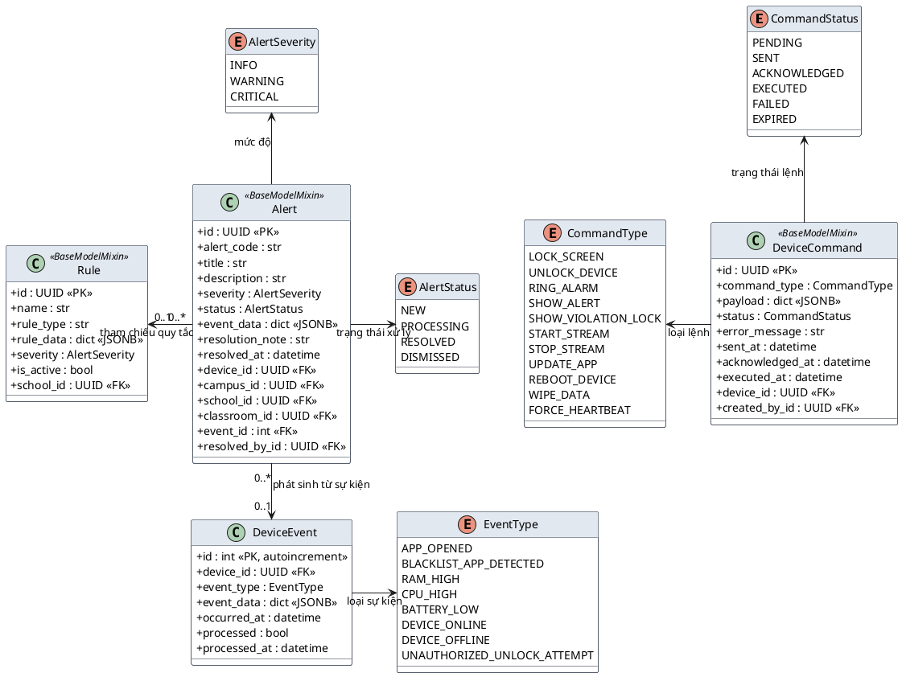
```plantuml
@startuml Hinh_2_9_ClassDiagram_Lenh_CanhBao
top to bottom direction
skinparam linetype ortho
skinparam nodesep 55
skinparam ranksep 60
skinparam classAttributeIconSize 0
skinparam shadowing false
skinparam class {
    BackgroundColor #FFFFFF
    BorderColor #1E293B
    HeaderBackgroundColor #E2E8F0
}

enum CommandStatus {
    PENDING
    SENT
    ACKNOWLEDGED
    EXECUTED
    FAILED
    EXPIRED
}

enum AlertSeverity {
    INFO
    WARNING
    CRITICAL
}

enum AlertStatus {
    NEW
    PROCESSING
    RESOLVED
    DISMISSED
}

enum CommandType {
    LOCK_SCREEN
    UNLOCK_DEVICE
    RING_ALARM
    SHOW_ALERT
    SHOW_VIOLATION_LOCK
    START_STREAM
    STOP_STREAM
    UPDATE_APP
    REBOOT_DEVICE
    WIPE_DATA
    FORCE_HEARTBEAT
}

class DeviceCommand <<BaseModelMixin>> {
    + id : UUID <<PK>>
    + command_type : CommandType
    + payload : dict <<JSONB>>
    + status : CommandStatus
    + error_message : str
    + sent_at : datetime
    + acknowledged_at : datetime
    + executed_at : datetime
    + device_id : UUID <<FK>>
    + created_by_id : UUID <<FK>>
}

class Alert <<BaseModelMixin>> {
    + id : UUID <<PK>>
    + alert_code : str
    + title : str
    + description : str
    + severity : AlertSeverity
    + status : AlertStatus
    + event_data : dict <<JSONB>>
    + resolution_note : str
    + resolved_at : datetime
    + device_id : UUID <<FK>>
    + campus_id : UUID <<FK>>
    + school_id : UUID <<FK>>
    + classroom_id : UUID <<FK>>
    + event_id : int <<FK>>
    + resolved_by_id : UUID <<FK>>
}

class Rule <<BaseModelMixin>> {
    + id : UUID <<PK>>
    + name : str
    + rule_type : str
    + rule_data : dict <<JSONB>>
    + severity : AlertSeverity
    + is_active : bool
    + school_id : UUID <<FK>>
}

class DeviceEvent {
    + id : int <<PK, autoincrement>>
    + device_id : UUID <<FK>>
    + event_type : EventType
    + event_data : dict <<JSONB>>
    + occurred_at : datetime
    + processed : bool
    + processed_at : datetime
}

enum EventType {
    APP_OPENED
    BLACKLIST_APP_DETECTED
    RAM_HIGH
    CPU_HIGH
    BATTERY_LOW
    DEVICE_ONLINE
    DEVICE_OFFLINE
    UNAUTHORIZED_UNLOCK_ATTEMPT
}

DeviceCommand -up-> CommandStatus : trạng thái lệnh
DeviceCommand -left-> CommandType : loại lệnh

Alert -up-> AlertSeverity : mức độ
Alert -right-> AlertStatus : trạng thái xử lý
Alert "0..*" -down-> "0..1" DeviceEvent : phát sinh từ sự kiện
Alert "0..*" -left-> "0..1" Rule : tham chiếu quy tắc

DeviceEvent -right-> EventType : loại sự kiện
@enduml
```

---

## Hình 2.10. Class Diagram nhóm người dùng và nhật ký hệ thống (3)

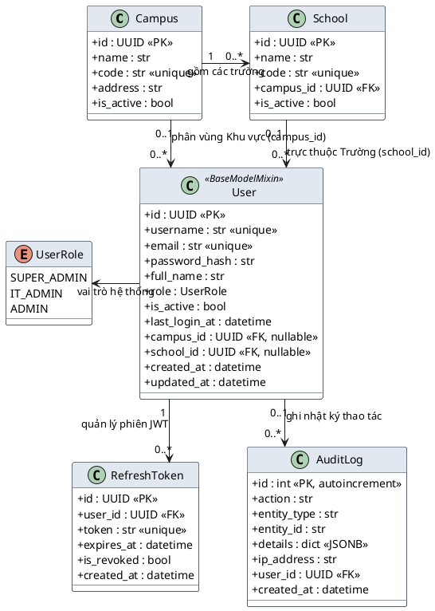
```plantuml
@startuml Hinh_2_10_ClassDiagram_NguoiDung_NhatKy
top to bottom direction
skinparam linetype ortho
skinparam nodesep 60
skinparam ranksep 60
skinparam classAttributeIconSize 0
skinparam shadowing false
skinparam class {
    BackgroundColor #FFFFFF
    BorderColor #1E293B
    HeaderBackgroundColor #E2E8F0
}

class Campus {
    + id : UUID <<PK>>
    + name : str
    + code : str <<unique>>
    + address : str
    + is_active : bool
}

class School {
    + id : UUID <<PK>>
    + name : str
    + code : str <<unique>>
    + campus_id : UUID <<FK>>
    + is_active : bool
}

enum UserRole {
    SUPER_ADMIN
    IT_ADMIN
    ADMIN
}

class User <<BaseModelMixin>> {
    + id : UUID <<PK>>
    + username : str <<unique>>
    + email : str <<unique>>
    + password_hash : str
    + full_name : str
    + role : UserRole
    + is_active : bool
    + last_login_at : datetime
    + campus_id : UUID <<FK, nullable>>
    + school_id : UUID <<FK, nullable>>
    + created_at : datetime
    + updated_at : datetime
}

class RefreshToken {
    + id : UUID <<PK>>
    + user_id : UUID <<FK>>
    + token : str <<unique>>
    + expires_at : datetime
    + is_revoked : bool
    + created_at : datetime
}

class AuditLog {
    + id : int <<PK, autoincrement>>
    + action : str
    + entity_type : str
    + entity_id : str
    + details : dict <<JSONB>>
    + ip_address : str
    + user_id : UUID <<FK>>
    + created_at : datetime
}

Campus "1" -right-> "0..*" School : gồm các trường
Campus "0..1" -down-> "0..*" User : phân vùng Khu vực (campus_id)
School "0..1" -down-> "0..*" User : trực thuộc Trường (school_id)

User -left-> UserRole : vai trò hệ thống
User "1" -down-> "0..*" RefreshToken : quản lý phiên JWT
User "0..1" -down-> "0..*" AuditLog : ghi nhật ký thao tác
@enduml
```

---

## Hình 2.11. Sơ đồ hoạt động luồng ghi danh thiết bị

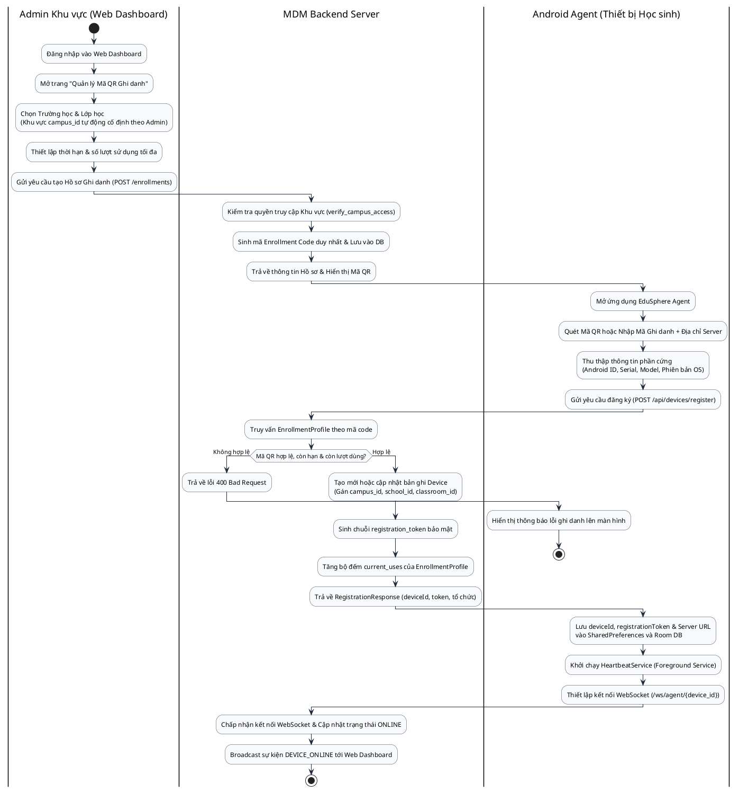
```plantuml
@startuml Hinh_2_11_Activity_GhiDanhThietBi
skinparam linetype ortho
skinparam shadowing false
skinparam conditionStyle inside
skinparam activity {
    BackgroundColor #F8FAFC
    BorderColor #334155
    ArrowColor #1E293B
    BarColor #1E293B
}

|Admin Khu vực (Web Dashboard)|
start
:Đăng nhập vào Web Dashboard;
:Mở trang "Quản lý Mã QR Ghi danh";
:Chọn Trường học & Lớp học\n(Khu vực campus_id tự động cố định theo Admin);
:Thiết lập thời hạn & số lượt sử dụng tối đa;
:Gửi yêu cầu tạo Hồ sơ Ghi danh (POST /enrollments);

|MDM Backend Server|
:Kiểm tra quyền truy cập Khu vực (verify_campus_access);
:Sinh mã Enrollment Code duy nhất & Lưu vào DB;
:Trả về thông tin Hồ sơ & Hiển thị Mã QR;

|Android Agent (Thiết bị Học sinh)|
:Mở ứng dụng EduSphere Agent;
:Quét Mã QR hoặc Nhập Mã Ghi danh + Địa chỉ Server;
:Thu thập thông tin phần cứng\n(Android ID, Serial, Model, Phiên bản OS);
:Gửi yêu cầu đăng ký (POST /api/devices/register);

|MDM Backend Server|
:Truy vấn EnrollmentProfile theo mã code;
if (Mã QR hợp lệ, còn hạn & còn lượt dùng?) then (Không hợp lệ)
    :Trả về lỗi 400 Bad Request;
    |Android Agent (Thiết bị Học sinh)|
    :Hiển thị thông báo lỗi ghi danh lên màn hình;
    stop
else (Hợp lệ)
    |MDM Backend Server|
    :Tạo mới hoặc cập nhật bản ghi Device\n(Gán campus_id, school_id, classroom_id);
    :Sinh chuỗi registration_token bảo mật;
    :Tăng bộ đếm current_uses của EnrollmentProfile;
    :Trả về RegistrationResponse (deviceId, token, tổ chức);
endif

|Android Agent (Thiết bị Học sinh)|
:Lưu deviceId, registrationToken & Server URL\nvào SharedPreferences và Room DB;
:Khởi chạy HeartbeatService (Foreground Service);
:Thiết lập kết nối WebSocket (/ws/agent/{device_id});

|MDM Backend Server|
:Chấp nhận kết nối WebSocket & Cập nhật trạng thái ONLINE;
:Broadcast sự kiện DEVICE_ONLINE tới Web Dashboard;
stop
@enduml
```

---

## Hình 2.12. Sơ đồ hoạt động phát hiện ứng dụng cấm và khóa màn hình tự động

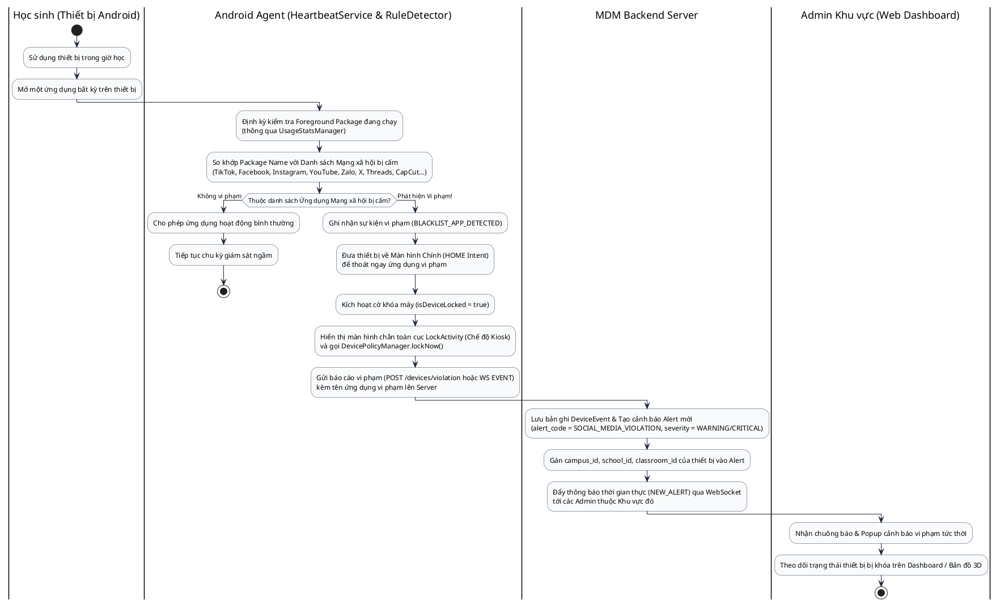
```plantuml
@startuml Hinh_2_12_Activity_ChanApp_TuDongKhoa
skinparam linetype ortho
skinparam shadowing false
skinparam conditionStyle inside
skinparam activity {
    BackgroundColor #F8FAFC
    BorderColor #334155
    ArrowColor #1E293B
}

|Học sinh (Thiết bị Android)|
start
:Sử dụng thiết bị trong giờ học;
:Mở một ứng dụng bất kỳ trên thiết bị;

|Android Agent (HeartbeatService & RuleDetector)|
:Định kỳ kiểm tra Foreground Package đang chạy\n(thông qua UsageStatsManager);
:So khớp Package Name với Danh sách Mạng xã hội bị cấm\n(TikTok, Facebook, Instagram, YouTube, Zalo, X, Threads, CapCut...);

if (Thuộc danh sách Ứng dụng Mạng xã hội bị cấm?) then (Không vi phạm)
    :Cho phép ứng dụng hoạt động bình thường;
    :Tiếp tục chu kỳ giám sát ngầm;
    stop
else (Phát hiện Vi phạm!)
    :Ghi nhận sự kiện vi phạm (BLACKLIST_APP_DETECTED);
    :Đưa thiết bị về Màn hình Chính (HOME Intent)\nđể thoát ngay ứng dụng vi phạm;
    :Kích hoạt cờ khóa máy (isDeviceLocked = true);
    :Hiển thị màn hình chắn toàn cục LockActivity (Chế độ Kiosk)\nvà gọi DevicePolicyManager.lockNow();
    :Gửi báo cáo vi phạm (POST /devices/violation hoặc WS EVENT)\nkèm tên ứng dụng vi phạm lên Server;
endif

|MDM Backend Server|
:Lưu bản ghi DeviceEvent & Tạo cảnh báo Alert mới\n(alert_code = SOCIAL_MEDIA_VIOLATION, severity = WARNING/CRITICAL);
:Gán campus_id, school_id, classroom_id của thiết bị vào Alert;
:Đẩy thông báo thời gian thực (NEW_ALERT) qua WebSocket\ntới các Admin thuộc Khu vực đó;

|Admin Khu vực (Web Dashboard)|
:Nhận chuông báo & Popup cảnh báo vi phạm tức thời;
:Theo dõi trạng thái thiết bị bị khóa trên Dashboard / Bản đồ 3D;
stop
@enduml
```

---

## Hình 2.13. Sơ đồ hoạt động điều khiển thiết bị từ xa và xử lý cảnh báo

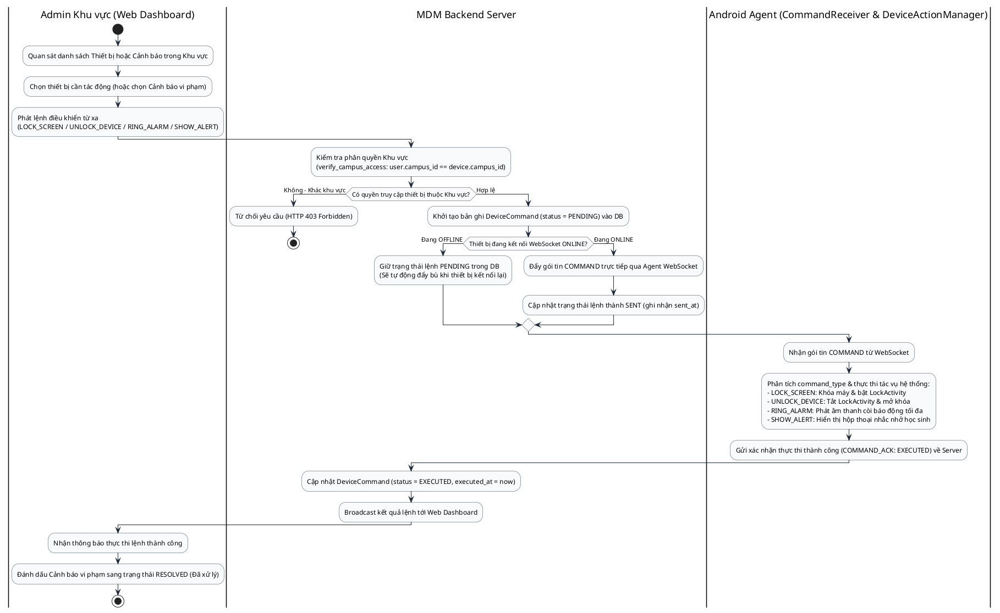
```plantuml
@startuml Hinh_2_13_Activity_DieuKhienVaXuLyCanhBao
skinparam linetype ortho
skinparam shadowing false
skinparam conditionStyle inside
skinparam activity {
    BackgroundColor #F8FAFC
    BorderColor #334155
    ArrowColor #1E293B
}

|Admin Khu vực (Web Dashboard)|
start
:Quan sát danh sách Thiết bị hoặc Cảnh báo trong Khu vực;
:Chọn thiết bị cần tác động (hoặc chọn Cảnh báo vi phạm);
:Phát lệnh điều khiển từ xa\n(LOCK_SCREEN / UNLOCK_DEVICE / RING_ALARM / SHOW_ALERT);

|MDM Backend Server|
:Kiểm tra phân quyền Khu vực\n(verify_campus_access: user.campus_id == device.campus_id);
if (Có quyền truy cập thiết bị thuộc Khu vực?) then (Không - Khác khu vực)
    :Từ chối yêu cầu (HTTP 403 Forbidden);
    stop
else (Hợp lệ)
    :Khởi tạo bản ghi DeviceCommand (status = PENDING) vào DB;
    if (Thiết bị đang kết nối WebSocket ONLINE?) then (Đang OFFLINE)
        :Giữ trạng thái lệnh PENDING trong DB\n(Sẽ tự động đẩy bù khi thiết bị kết nối lại);
    else (Đang ONLINE)
        :Đẩy gói tin COMMAND trực tiếp qua Agent WebSocket;
        :Cập nhật trạng thái lệnh thành SENT (ghi nhận sent_at);
    endif
endif

|Android Agent (CommandReceiver & DeviceActionManager)|
:Nhận gói tin COMMAND từ WebSocket;
:Phân tích command_type & thực thi tác vụ hệ thống:\n- LOCK_SCREEN: Khóa máy & bật LockActivity\n- UNLOCK_DEVICE: Tắt LockActivity & mở khóa\n- RING_ALARM: Phát âm thanh còi báo động tối đa\n- SHOW_ALERT: Hiển thị hộp thoại nhắc nhở học sinh;
:Gửi xác nhận thực thi thành công (COMMAND_ACK: EXECUTED) về Server;

|MDM Backend Server|
:Cập nhật DeviceCommand (status = EXECUTED, executed_at = now);
:Broadcast kết quả lệnh tới Web Dashboard;

|Admin Khu vực (Web Dashboard)|
:Nhận thông báo thực thi lệnh thành công;
:Đánh dấu Cảnh báo vi phạm sang trạng thái RESOLVED (Đã xử lý);
stop
@enduml
```

---

## Hình 2.14. Sơ đồ hoạt động quản lý và giám sát lớp học 3D

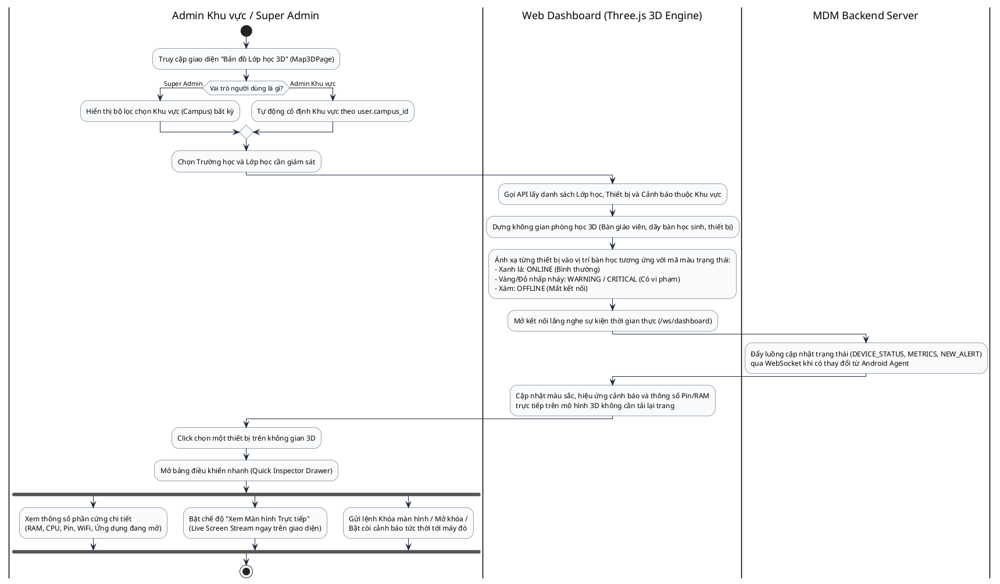
```plantuml
@startuml Hinh_2_14_Activity_GiamSatLopHoc3D
skinparam linetype ortho
skinparam shadowing false
skinparam conditionStyle inside
skinparam activity {
    BackgroundColor #F8FAFC
    BorderColor #334155
    ArrowColor #1E293B
}

|Admin Khu vực / Super Admin|
start
:Truy cập giao diện "Bản đồ Lớp học 3D" (Map3DPage);
if (Vai trò người dùng là gì?) then (Super Admin)
    :Hiển thị bộ lọc chọn Khu vực (Campus) bất kỳ;
else (Admin Khu vực)
    :Tự động cố định Khu vực theo user.campus_id;
endif
:Chọn Trường học và Lớp học cần giám sát;

|Web Dashboard (Three.js 3D Engine)|
:Gọi API lấy danh sách Lớp học, Thiết bị và Cảnh báo thuộc Khu vực;
:Dựng không gian phòng học 3D (Bàn giáo viên, dãy bàn học sinh, thiết bị);
:Ánh xạ từng thiết bị vào vị trí bàn học tương ứng với mã màu trạng thái:\n- Xanh lá: ONLINE (Bình thường)\n- Vàng/Đỏ nhấp nháy: WARNING / CRITICAL (Có vi phạm)\n- Xám: OFFLINE (Mất kết nối);
:Mở kết nối lắng nghe sự kiện thời gian thực (/ws/dashboard);

|MDM Backend Server|
:Đẩy luồng cập nhật trạng thái (DEVICE_STATUS, METRICS, NEW_ALERT)\nqua WebSocket khi có thay đổi từ Android Agent;

|Web Dashboard (Three.js 3D Engine)|
:Cập nhật màu sắc, hiệu ứng cảnh báo và thông số Pin/RAM\ntrực tiếp trên mô hình 3D không cần tải lại trang;

|Admin Khu vực / Super Admin|
:Click chọn một thiết bị trên không gian 3D;
:Mở bảng điều khiển nhanh (Quick Inspector Drawer);
fork
    :Xem thông số phần cứng chi tiết\n(RAM, CPU, Pin, WiFi, Ứng dụng đang mở);
fork again
    :Bật chế độ "Xem Màn hình Trực tiếp"\n(Live Screen Stream ngay trên giao diện);
fork again
    :Gửi lệnh Khóa màn hình / Mở khóa /\nBật còi cảnh báo tức thời tới máy đó;
end fork
stop
@enduml
```

---

## Hình 2.15. Sơ đồ tuần tự cập nhật ứng dụng ngầm

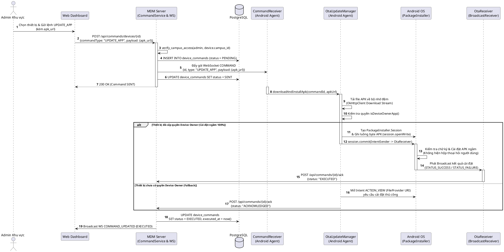
```plantuml
@startuml Hinh_2_15_Sequence_CapNhatUngDungNgam
autonumber
skinparam shadowing false
skinparam sequenceMessageAlign center
skinparam responseMessageBelowArrow true

actor "Admin Khu vực" as Admin
participant "Web Dashboard" as Web
participant "MDM Server\n(CommandService & WS)" as Server
database "PostgreSQL" as DB
participant "CommandReceiver\n(Android Agent)" as WSClient
participant "OtaUpdateManager\n(Android Agent)" as OTA
participant "Android OS\n(PackageInstaller)" as OS
participant "OtaReceiver\n(BroadcastReceiver)" as Receiver

Admin -> Web : Chọn thiết bị & Gửi lệnh UPDATE_APP\n(kèm apk_url)
Web -> Server : POST /api/commands/devices/{id}\n{commandType: "UPDATE_APP", payload: {apk_url}}
activate Server

Server -> Server : verify_campus_access(admin, device.campus_id)
Server -> DB : INSERT INTO device_commands (status = PENDING)
Server -> WSClient : Đẩy gói WebSocket COMMAND\n{id, type: "UPDATE_APP", payload: {apk_url}}
Server -> DB : UPDATE device_commands SET status = SENT
Server --> Web : 200 OK (Command SENT)
deactivate Server

activate WSClient
WSClient -> OTA : downloadAndInstallApk(commandId, apkUrl)
deactivate WSClient

activate OTA
OTA -> OTA : Tải file APK về bộ nhớ đệm\n(OkHttpClient Download Stream)
OTA -> OTA : Kiểm tra quyền isDeviceOwnerApp()

alt Thiết bị đã cấp quyền Device Owner (Cài đặt ngầm 100%)
    OTA -> OS : Tạo PackageInstaller.Session\n& Ghi luồng byte APK (session.openWrite)
    OTA -> OS : session.commit(IntentSender -> OtaReceiver)
    deactivate OTA
    activate OS
    OS -> OS : Kiểm tra chữ ký & Cài đặt APK ngầm\n(Không hiện hộp thoại hỏi người dùng)
    OS -> Receiver : Phát Broadcast kết quả cài đặt\n(STATUS_SUCCESS / STATUS_FAILURE)
    deactivate OS
    activate Receiver
    Receiver -> Server : POST /api/commands/{id}/ack\n{status: "EXECUTED"}
    deactivate Receiver
else Thiết bị chưa có quyền Device Owner (Fallback)
    OTA -> OS : Mở Intent ACTION_VIEW (FileProvider URI)\nyêu cầu cài đặt thủ công
    OTA -> Server : POST /api/commands/{id}/ack\n{status: "ACKNOWLEDGED"}
end

activate Server
Server -> DB : UPDATE device_commands\nSET status = EXECUTED, executed_at = now()
Server -> Web : Broadcast WS COMMAND_UPDATED (EXECUTED)
deactivate Server
@enduml
```

---

## Hình 2.16. Sơ đồ tuần tự truyền phát màn hình

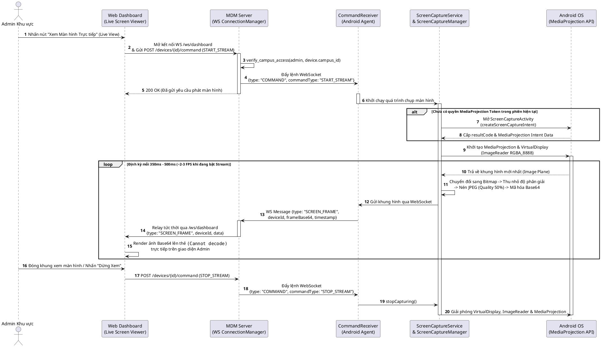
```plantuml
@startuml Hinh_2_16_Sequence_TruyenPhatManHinh
autonumber
skinparam shadowing false
skinparam sequenceMessageAlign center

actor "Admin Khu vực" as Admin
participant "Web Dashboard\n(Live Screen Viewer)" as Web
participant "MDM Server\n(WS ConnectionManager)" as Server
participant "CommandReceiver\n(Android Agent)" as AgentWS
participant "ScreenCaptureService\n& ScreenCaptureManager" as Capture
participant "Android OS\n(MediaProjection API)" as OS

Admin -> Web : Nhấn nút "Xem Màn hình Trực tiếp" (Live View)
Web -> Server : Mở kết nối WS /ws/dashboard\n& Gửi POST /devices/{id}/command (START_STREAM)
activate Server

Server -> Server : verify_campus_access(admin, device.campus_id)
Server -> AgentWS : Đẩy lệnh WebSocket\n{type: "COMMAND", commandType: "START_STREAM"}
Server --> Web : 200 OK (Đã gửi yêu cầu phát màn hình)
deactivate Server

activate AgentWS
AgentWS -> Capture : Khởi chạy quá trình chụp màn hình
deactivate AgentWS

activate Capture
alt Chưa có quyền MediaProjection Token trong phiên hiện tại
    Capture -> OS : Mở ScreenCaptureActivity\n(createScreenCaptureIntent)
    OS --> Capture : Cấp resultCode & MediaProjection Intent Data
end

Capture -> OS : Khởi tạo MediaProjection & VirtualDisplay\n(ImageReader RGBA_8888)
activate OS

loop Định kỳ mỗi 350ms - 500ms (~2-3 FPS khi đang bật Stream)
    OS --> Capture : Trả về khung hình mới nhất (Image Plane)
    Capture -> Capture : Chuyển đổi sang Bitmap -> Thu nhỏ độ phân giải\n-> Nén JPEG (Quality 50%) -> Mã hóa Base64
    Capture -> AgentWS : Gửi khung hình qua WebSocket
    AgentWS -> Server : WS Message {type: "SCREEN_FRAME",\ndeviceId, frameBase64, timestamp}
    activate Server
    Server -> Web : Relay tức thời qua /ws/dashboard\n{type: "SCREEN_FRAME", deviceId, data}
    deactivate Server
    Web -> Web : Render ảnh Base64 lên thẻ <img / canvas>\ntrực tiếp trên giao diện Admin
end

Admin -> Web : Đóng khung xem màn hình / Nhấn "Dừng Xem"
Web -> Server : POST /devices/{id}/command (STOP_STREAM)
Server -> AgentWS : Đẩy lệnh WebSocket\n{type: "COMMAND", commandType: "STOP_STREAM"}
AgentWS -> Capture : stopCapturing()
Capture -> OS : Giải phóng VirtualDisplay, ImageReader & MediaProjection
deactivate OS
deactivate Capture
@enduml
```

---

## Hình 2.17. Sơ đồ tuần tự đồng bộ thông số thời gian thực

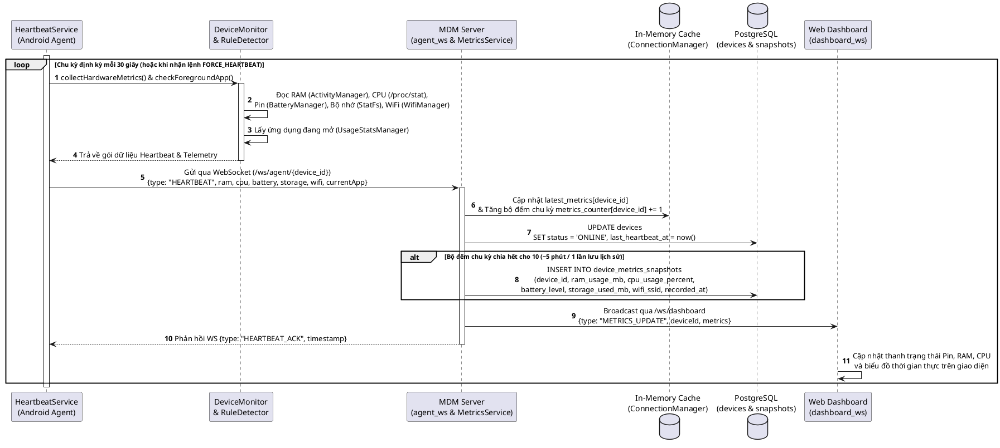
```plantuml
@startuml Hinh_2_17_Sequence_DongBoThongSo
autonumber
skinparam shadowing false
skinparam sequenceMessageAlign center

participant "HeartbeatService\n(Android Agent)" as Service
participant "DeviceMonitor\n& RuleDetector" as Monitor
participant "MDM Server\n(agent_ws & MetricsService)" as Server
database "In-Memory Cache\n(ConnectionManager)" as Cache
database "PostgreSQL\n(devices & snapshots)" as DB
participant "Web Dashboard\n(dashboard_ws)" as Web

activate Service
loop Chu kỳ định kỳ mỗi 30 giây (hoặc khi nhận lệnh FORCE_HEARTBEAT)
    Service -> Monitor : collectHardwareMetrics() & checkForegroundApp()
    activate Monitor
    Monitor -> Monitor : Đọc RAM (ActivityManager), CPU (/proc/stat),\nPin (BatteryManager), Bộ nhớ (StatFs), WiFi (WifiManager)
    Monitor -> Monitor : Lấy ứng dụng đang mở (UsageStatsManager)
    Monitor --> Service : Trả về gói dữ liệu Heartbeat & Telemetry
    deactivate Monitor

    Service -> Server : Gửi qua WebSocket (/ws/agent/{device_id})\n{type: "HEARTBEAT", ram, cpu, battery, storage, wifi, currentApp}
    activate Server

    Server -> Cache : Cập nhật latest_metrics[device_id]\n& Tăng bộ đếm chu kỳ metrics_counter[device_id] += 1
    Server -> DB : UPDATE devices\nSET status = 'ONLINE', last_heartbeat_at = now()

    alt Bộ đếm chu kỳ chia hết cho 10 (~5 phút / 1 lần lưu lịch sử)
        Server -> DB : INSERT INTO device_metrics_snapshots\n(device_id, ram_usage_mb, cpu_usage_percent,\nbattery_level, storage_used_mb, wifi_ssid, recorded_at)
    end

    Server -> Web : Broadcast qua /ws/dashboard\n{type: "METRICS_UPDATE", deviceId, metrics}
    Server --> Service : Phản hồi WS {type: "HEARTBEAT_ACK", timestamp}
    deactivate Server

    Web -> Web : Cập nhật thanh trạng thái Pin, RAM, CPU\nvà biểu đồ thời gian thực trên giao diện
end
deactivate Service
@enduml
```

---

## Hình 2.18. Sơ đồ lớp kiến trúc mã nguồn Backend

*(Đã căn thẳng 4 cột dọc tương ứng với 4 nhóm chức năng: `Auth/User` — `School/Device` — `Command/Metrics` — `Alert/Dashboard`, giúp các mũi tên đi thẳng từ trên xuống dưới bằng đường vuông góc `ortho`, không cắt ngang qua class nào).*

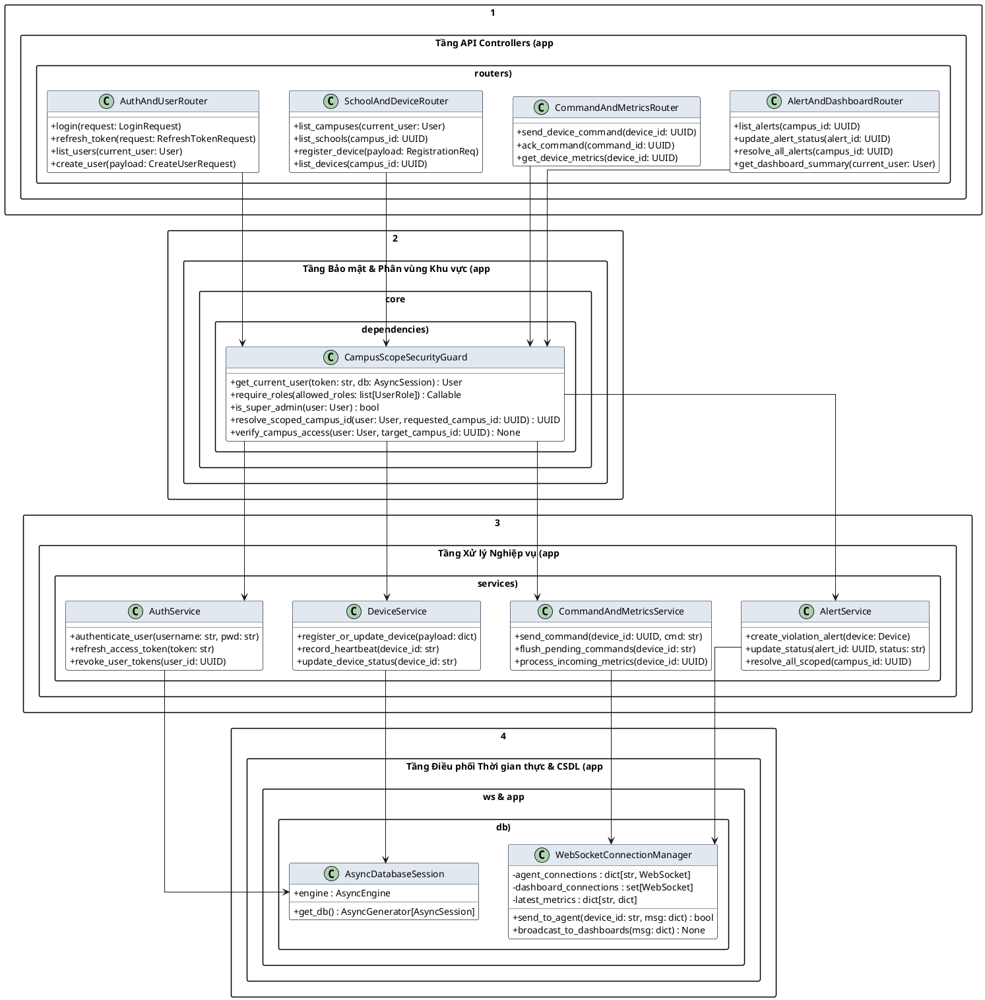
```plantuml
@startuml Hinh_2_18_ClassDiagram_KienTruc_Backend
top to bottom direction
skinparam linetype ortho
skinparam nodesep 45
skinparam ranksep 55
skinparam classAttributeIconSize 0
skinparam shadowing false
skinparam packageStyle rectangle
skinparam class {
    BackgroundColor #FFFFFF
    BorderColor #1E293B
    HeaderBackgroundColor #E2E8F0
}

package "1. Tầng API Controllers (app.routers)" {
    class AuthAndUserRouter {
        + login(request: LoginRequest)
        + refresh_token(request: RefreshTokenRequest)
        + list_users(current_user: User)
        + create_user(payload: CreateUserRequest)
    }
    class SchoolAndDeviceRouter {
        + list_campuses(current_user: User)
        + list_schools(campus_id: UUID)
        + register_device(payload: RegistrationReq)
        + list_devices(campus_id: UUID)
    }
    class CommandAndMetricsRouter {
        + send_device_command(device_id: UUID)
        + ack_command(command_id: UUID)
        + get_device_metrics(device_id: UUID)
    }
    class AlertAndDashboardRouter {
        + list_alerts(campus_id: UUID)
        + update_alert_status(alert_id: UUID)
        + resolve_all_alerts(campus_id: UUID)
        + get_dashboard_summary(current_user: User)
    }

    AuthAndUserRouter -[hidden]right- SchoolAndDeviceRouter
    SchoolAndDeviceRouter -[hidden]right- CommandAndMetricsRouter
    CommandAndMetricsRouter -[hidden]right- AlertAndDashboardRouter
}

package "2. Tầng Bảo mật & Phân vùng Khu vực (app.core.dependencies)" {
    class CampusScopeSecurityGuard {
        + get_current_user(token: str, db: AsyncSession) : User
        + require_roles(allowed_roles: list[UserRole]) : Callable
        + is_super_admin(user: User) : bool
        + resolve_scoped_campus_id(user: User, requested_campus_id: UUID) : UUID
        + verify_campus_access(user: User, target_campus_id: UUID) : None
    }
}

package "3. Tầng Xử lý Nghiệp vụ (app.services)" {
    class AuthService {
        + authenticate_user(username: str, pwd: str)
        + refresh_access_token(token: str)
        + revoke_user_tokens(user_id: UUID)
    }
    class DeviceService {
        + register_or_update_device(payload: dict)
        + record_heartbeat(device_id: str)
        + update_device_status(device_id: str)
    }
    class CommandAndMetricsService {
        + send_command(device_id: UUID, cmd: str)
        + flush_pending_commands(device_id: str)
        + process_incoming_metrics(device_id: UUID)
    }
    class AlertService {
        + create_violation_alert(device: Device)
        + update_status(alert_id: UUID, status: str)
        + resolve_all_scoped(campus_id: UUID)
    }

    AuthService -[hidden]right- DeviceService
    DeviceService -[hidden]right- CommandAndMetricsService
    CommandAndMetricsService -[hidden]right- AlertService
}

package "4. Tầng Điều phối Thời gian thực & CSDL (app.ws & app.db)" {
    class AsyncDatabaseSession {
        + engine : AsyncEngine
        + get_db() : AsyncGenerator[AsyncSession]
    }
    class WebSocketConnectionManager {
        - agent_connections : dict[str, WebSocket]
        - dashboard_connections : set[WebSocket]
        - latest_metrics : dict[str, dict]
        + send_to_agent(device_id: str, msg: dict) : bool
        + broadcast_to_dashboards(msg: dict) : None
    }
    AsyncDatabaseSession -[hidden]right- WebSocketConnectionManager
}

AuthAndUserRouter -down-> CampusScopeSecurityGuard
SchoolAndDeviceRouter -down-> CampusScopeSecurityGuard
CommandAndMetricsRouter -down-> CampusScopeSecurityGuard
AlertAndDashboardRouter -down-> CampusScopeSecurityGuard

CampusScopeSecurityGuard -down-> AuthService
CampusScopeSecurityGuard -down-> DeviceService
CampusScopeSecurityGuard -down-> CommandAndMetricsService
CampusScopeSecurityGuard -down-> AlertService

AuthService -down-> AsyncDatabaseSession
DeviceService -down-> AsyncDatabaseSession
CommandAndMetricsService -down-> WebSocketConnectionManager
AlertService -down-> WebSocketConnectionManager
@enduml
```

---

## Hình 2.19. Sơ đồ lớp kiến trúc mã nguồn Android Agent

*(Đã sắp xếp 3 tầng Clean Architecture theo cột dọc tương ứng: cột Ghi danh UI, cột Giám sát & Chặn App, cột Thực thi Lệnh & Khóa máy, cột Truyền phát Màn hình để các đường `ortho` đi thẳng từ trên xuống dưới).*

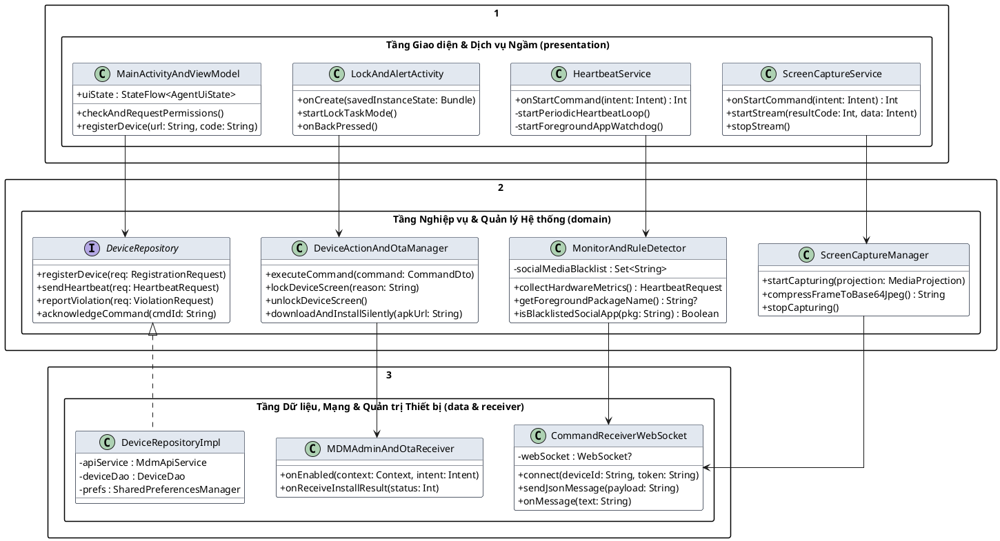
```plantuml
@startuml Hinh_2_19_ClassDiagram_KienTruc_AndroidAgent
top to bottom direction
skinparam linetype ortho
skinparam nodesep 45
skinparam ranksep 55
skinparam classAttributeIconSize 0
skinparam shadowing false
skinparam packageStyle rectangle
skinparam class {
    BackgroundColor #FFFFFF
    BorderColor #1E293B
    HeaderBackgroundColor #E2E8F0
}

package "1. Tầng Giao diện & Dịch vụ Ngầm (presentation)" {
    class MainActivityAndViewModel {
        + uiState : StateFlow<AgentUiState>
        + checkAndRequestPermissions()
        + registerDevice(url: String, code: String)
    }
    class HeartbeatService {
        + onStartCommand(intent: Intent) : Int
        - startPeriodicHeartbeatLoop()
        - startForegroundAppWatchdog()
    }
    class LockAndAlertActivity {
        + onCreate(savedInstanceState: Bundle)
        + startLockTaskMode()
        + onBackPressed()
    }
    class ScreenCaptureService {
        + onStartCommand(intent: Intent) : Int
        + startStream(resultCode: Int, data: Intent)
        + stopStream()
    }

    MainActivityAndViewModel -[hidden]right- HeartbeatService
    HeartbeatService -[hidden]right- LockAndAlertActivity
    LockAndAlertActivity -[hidden]right- ScreenCaptureService
}

package "2. Tầng Nghiệp vụ & Quản lý Hệ thống (domain)" {
    interface DeviceRepository {
        + registerDevice(req: RegistrationRequest)
        + sendHeartbeat(req: HeartbeatRequest)
        + reportViolation(req: ViolationRequest)
        + acknowledgeCommand(cmdId: String)
    }
    class MonitorAndRuleDetector {
        - socialMediaBlacklist : Set<String>
        + collectHardwareMetrics() : HeartbeatRequest
        + getForegroundPackageName() : String?
        + isBlacklistedSocialApp(pkg: String) : Boolean
    }
    class DeviceActionAndOtaManager {
        + executeCommand(command: CommandDto)
        + lockDeviceScreen(reason: String)
        + unlockDeviceScreen()
        + downloadAndInstallSilently(apkUrl: String)
    }
    class ScreenCaptureManager {
        + startCapturing(projection: MediaProjection)
        + compressFrameToBase64Jpeg() : String
        + stopCapturing()
    }

    DeviceRepository -[hidden]right- MonitorAndRuleDetector
    MonitorAndRuleDetector -[hidden]right- DeviceActionAndOtaManager
    DeviceActionAndOtaManager -[hidden]right- ScreenCaptureManager
}

package "3. Tầng Dữ liệu, Mạng & Quản trị Thiết bị (data & receiver)" {
    class DeviceRepositoryImpl {
        - apiService : MdmApiService
        - deviceDao : DeviceDao
        - prefs : SharedPreferencesManager
    }
    class CommandReceiverWebSocket {
        - webSocket : WebSocket?
        + connect(deviceId: String, token: String)
        + sendJsonMessage(payload: String)
        + onMessage(text: String)
    }
    class MDMAdminAndOtaReceiver {
        + onEnabled(context: Context, intent: Intent)
        + onReceiveInstallResult(status: Int)
    }

    DeviceRepositoryImpl -[hidden]right- CommandReceiverWebSocket
    CommandReceiverWebSocket -[hidden]right- MDMAdminAndOtaReceiver
}

MainActivityAndViewModel -down-> DeviceRepository
HeartbeatService -down-> MonitorAndRuleDetector
LockAndAlertActivity -down-> DeviceActionAndOtaManager
ScreenCaptureService -down-> ScreenCaptureManager

DeviceRepository <|.. DeviceRepositoryImpl
MonitorAndRuleDetector -down-> CommandReceiverWebSocket
DeviceActionAndOtaManager -down-> MDMAdminAndOtaReceiver
ScreenCaptureManager -down-> CommandReceiverWebSocket
@enduml
```

---

## Hình 2.20. (Sơ đồ bổ sung) Sơ đồ hoạt động kiểm soát truy cập theo Khu vực (Campus Scope Isolation)

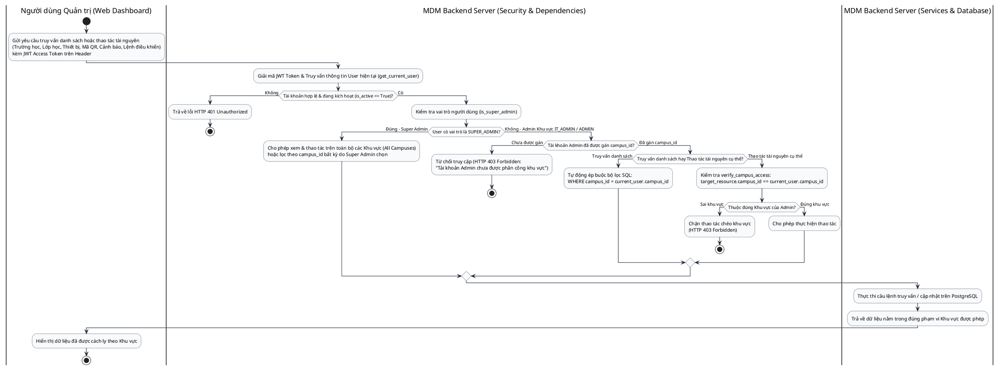
```plantuml
@startuml Hinh_2_20_Activity_PhanQuyenKhuVuc
skinparam linetype ortho
skinparam shadowing false
skinparam conditionStyle inside
skinparam activity {
    BackgroundColor #F8FAFC
    BorderColor #334155
    ArrowColor #1E293B
}

|Người dùng Quản trị (Web Dashboard)|
start
:Gửi yêu cầu truy vấn danh sách hoặc thao tác tài nguyên\n(Trường học, Lớp học, Thiết bị, Mã QR, Cảnh báo, Lệnh điều khiển)\nkèm JWT Access Token trên Header;

|MDM Backend Server (Security & Dependencies)|
:Giải mã JWT Token & Truy vấn thông tin User hiện tại (get_current_user);
if (Tài khoản hợp lệ & đang kích hoạt (is_active == True)?) then (Không)
    :Trả về lỗi HTTP 401 Unauthorized;
    stop
else (Có)
    :Kiểm tra vai trò người dùng (is_super_admin);
    if (User có vai trò là SUPER_ADMIN?) then (Đúng - Super Admin)
        :Cho phép xem & thao tác trên toàn bộ các Khu vực (All Campuses)\nhoặc lọc theo campus_id bất kỳ do Super Admin chọn;
    else (Không - Admin Khu vực IT_ADMIN / ADMIN)
        if (Tài khoản Admin đã được gán campus_id?) then (Chưa được gán)
            :Từ chối truy cập (HTTP 403 Forbidden:\n"Tài khoản Admin chưa được phân công khu vực");
            stop
        else (Đã gán campus_id)
            if (Truy vấn danh sách hay Thao tác tài nguyên cụ thể?) then (Truy vấn danh sách)
                :Tự động ép buộc bộ lọc SQL:\nWHERE campus_id = current_user.campus_id;
            else (Thao tác tài nguyên cụ thể)
                :Kiểm tra verify_campus_access:\ntarget_resource.campus_id == current_user.campus_id;
                if (Thuộc đúng Khu vực của Admin?) then (Sai khu vực)
                    :Chặn thao tác chéo khu vực\n(HTTP 403 Forbidden);
                    stop
                else (Đúng khu vực)
                    :Cho phép thực hiện thao tác;
                endif
            endif
        endif
    endif
endif

|MDM Backend Server (Services & Database)|
:Thực thi câu lệnh truy vấn / cập nhật trên PostgreSQL;
:Trả về dữ liệu nằm trong đúng phạm vi Khu vực được phép;

|Người dùng Quản trị (Web Dashboard)|
:Hiển thị dữ liệu đã được cách ly theo Khu vực;
stop
@enduml
```
